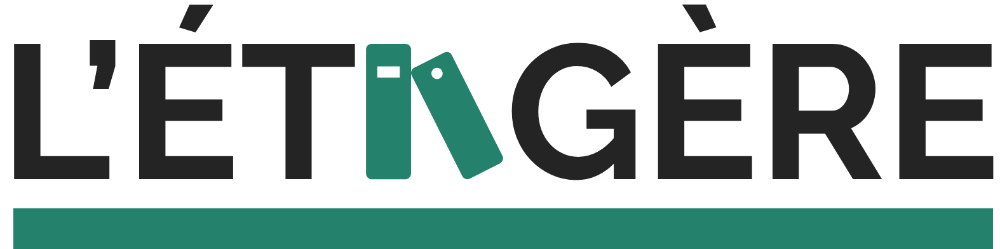

#

Le but de notre site est de favoriser le marché d’occasion , permettre aux inscrits de trouver facilement des titres près de chez eux et de se constituer une bibliothèque virtuelle.
Le site s’adresse aux lecteurs et libraires de France , soucieux de l’économie locale et de la surconsommation liée à la grande disponibilité des gros groupes e-commerce .

## Le coeur du projet 

Construire sa bibliothèque de livre (Lu, en cours de lecture, pas lu, souhaits)
Proposer des titres à la vente/échange
Etre alerté des propositions ou demandes des inscrits  ( notifications ? )
Trouver des livres près de chez moi
Poster une critique sur mes lectures ( format blog )
Poster un avis sur un livre

## Les évolutions

Une partie professionnelle pour permettre au libraire de proposer leur titres.
Une partie Modérateur pour les contenus postés par les users
Un tchat.
Payer en ligne ?

## Les Rôles sur le projet 

* Product Owner : Benjamin Trioullier
* Scrum Master : Alexis Cabillic
* Lead Dev Front : Arnaud Soulabaille
* Lead Dev Back : Benjamin Triouillier
* Référent Technique Front : Aurélien Nicolet
* Référent Technique Back : Mathieu Llegou
